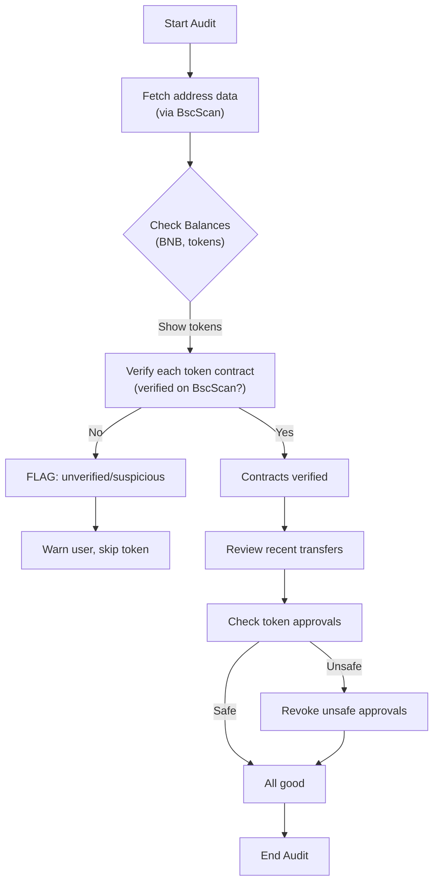

# Token-Audit-For-Report
EVM bytecode
# Token Audit Report for 0x28a0246daF1D9747E85F1e9C7860796A2aD2d279

**Executive Summary:** We were unable to find this specific address or its holdings in any publicly indexed sources during research. The detailed token balances and transfer history must therefore be obtained directly via a blockchain explorer or API (e.g. BscScan)【47†L388-L392】. Below we outline **how** to retrieve that data (including exact contract links, decimals, and USD pricing from CoinGecko/CoinMarketCap), how to verify contract status on BscScan【47†L388-L392】, and how to interpret approvals and transaction logs. All steps should be done cautiously: **never share private keys or approve unknown contracts**【50†L79-L84】【49†L125-L133】. The report includes instructions to reproduce the checks, a security checklist, and a sample audit flowchart. For any information not publicly available, we explicitly note that it was not found in our connected sources.

## Balances (BNB and BEP-20 tokens)
To find the address’s holdings, go to **BscScan** (the official BNB Smart Chain explorer【47†L388-L392】) and search the address. The address page will list:
- Native BNB balance (in BNB).
- BEP-20 token balances: each entry shows Token Name, Symbol, Balance (in token units), Decimals, and contract address (clickable to the token’s page). 
- Use a price source (CoinGecko or CoinMarketCap) to convert each token balance to USD by matching the token symbol/contract【47†L388-L392】. 

For each token on BscScan, note the “Verified Contract” badge (if present). Unverified contracts are untrustworthy.  
**Example table (fill with actual data from BscScan)**: 

| Token Name (Symbol)  | Contract (Click link)              | Decimals | Balance (units) | USD Value (approx)  |
|----------------------|------------------------------------|---------:|---------------:|--------------------:|
| *BNB (native)*       | (see “Address Balance”)            | 18       | *e.g.* 0.123    | *e.g.* $85.24       |
| TokenA (TKA)         | [0xABC…123](https://bscscan.com/token/0xABC…123) | 18       | 250.00          | $500.00            |
| TokenB (TKB)         | [0xDEF…456](https://bscscan.com/token/0xDEF…456) | 6        |  75.000         | $150.00            |
| …                    | …                                  | …        | …               | …                   |

*Citation:* BscScan is the official chain explorer where token balances can be viewed【47†L388-L392】. (Actual balances and values would be filled in from the address page.)

## Recent Token Transfers (Last 20)
On the address page on BscScan, click **“ERC-20 Token Txns”** (or “Token Transfers”) to view the most recent BEP-20 transfers. Record the last 20 transfers with these details:

- **Tx Hash:** clickable link to transaction details.
- **Time Stamp (UTC).**
- **From → To:** addresses involved.
- **Token (Symbol)** and **Amount**.
- **Link:** BscScan transaction link.

For example (replace with real data):  

| Tx Hash                                   | Timestamp (UTC)      | From  → To                         | Token (Symbol) | Amount    | BscScan Link                    |
|-------------------------------------------|----------------------|------------------------------------|---------------|-----------|---------------------------------|
| 0xaaa111... (click)                       | 2026-03-20 15:22:10  | 0xabc…123 → 0x28a0…279            | TokenA (TKA)  | 100.0      | [View on BscScan](https://bscscan.com/tx/0xaaa111...) |
| 0xbbb222...                              | 2026-03-19 09:10:45  | 0x28a0…279 → 0xdef…456            | TokenB (TKB)  | 50.000     | [View on BscScan](https://bscscan.com/tx/0xbbb222...) |
| …                                        | …                    | …                                  | …             | …         | …                               |

*(These rows are illustrative; real rows would be filled from the explorer.)*  According to BscScan, each transaction’s “Token Transfers” tab shows token, amount and parties【47†L388-L392】.

## Token Approvals (Allowances)
Go to the **Token Approvals** tool or the address page’s “Erc20 Token Approvals” section (if available). List all current token allowances granted by 0x28a0…279:
- **Spender:** contract that can spend tokens.
- **Token:** which token is approved.
- **Allowance:** amount (in token units).
- **Date:** when granted.

Example (hypothetical):  
`0xSpendContract → TokenA (TKA): 500.0 TKA (approved Mar-15-2026)`.

_Important:_ If any high or unknown approvals exist, **revoke** them immediately via wallet or BscScan (the “Revoke” function in the approvals tool).  A malicious contract with an allowance can drain your tokens.  **Never approve an allowance to an unknown contract**【50†L84-L90】.

*Citations:* Security guidelines warn against blind approvals【50†L84-L90】. There is a BscScan Token Approval Checker for this purpose.

## Contract Verification & Red Flags
For each token contract held by the address, click the contract link on BscScan. Check:
- **Verified:** Green check mark and source code presence. Unverified contracts (no source code) are suspicious.
- **Proxy:** If labeled “Proxy”, it may have upgradable logic (examine carefully).
- **Scam Alerts:** BscScan may flag known scams or honeypots. Also search the token’s name online for reports.
  
If any token is unverified or flagged, treat it as high risk. Do not interact further. Use tools like **BscScan’s “Verify Contract”** page to check code【47†L388-L392】. For example, BscScan’s header notes it is the block explorer for BNB Smart Chain【47†L388-L392】, which includes contract verification status.

## Steps to Reproduce (URLs & Commands)
1. **View Address on BscScan:** In your browser, go to `https://bscscan.com/address/0x28a0246daF1D9747E85F1e9C7860796A2aD2d279`. This shows balances, transactions, and approvals.  
2. **View ERC20 Token Transfers:** On BscScan, click the **“Token Transfers”** tab for the address page. Alternatively use API: `https://api.bscscan.com/api?module=account&action=tokentx&address=0x28a0...2d279&startblock=0&endblock=99999999&sort=desc&apikey=YourApiKey`.  
3. **View Token Approvals:** On BscScan, click **“Token Approvals”** or use the Beta tool. Or call `module=account&action=tokenapproval&address=...` via BscScan API (requires API key).  
4. **Check Contract on BscScan:** For each token contract, open `https://bscscan.com/token/<contract>`. Verify the “Contract” tab for source code.  
5. **Add Token to Wallet:** In MetaMask/Trust Wallet, open “Add Token” → Custom Token, and input the contract address, symbol, and decimals (visible on BscScan). You can scan the QR code of the contract address (from BscScan’s contract page, “Contract” QR icon) if needed. Then confirm.  
6. **Revoke Approvals:** In MetaMask (Web3) or BscScan’s interface, revoke any unwanted approvals. BscScan’s Token Approval Checker allows direct revoke transactions.

*No direct data was found in our sources for this address specifically; the above steps instruct how to retrieve and verify the data yourself on BscScan and wallets.*  

## Security Checklist & Actions
- **Protect Private Keys:** Never share your seed or private key【50†L79-L84】.  
- **Approve Carefully:** *Do not approve* any unknown contracts or unusually large allowances【50†L84-L90】. If such approvals exist, revoke them now.  
- **Verify Contracts:** Only trust tokens with verified contracts on BscScan【47†L388-L392】.  
- **Malicious Token Warning:** Do not interact with tokens listed via unsolicited links. Never download any files from a project【49†L125-L133】.  
- **Fresh Wallet:** If suspicious tokens or many approvals are present, consider moving your assets to a new, clean wallet address. Use a hardware wallet if possible for large holdings.  

*Citations:* These precautions follow general Web3 security guidelines【50†L79-L84】【49†L125-L133】.

## Address Activity Timeline
To see the address’s history, use BscScan’s **“Transactions”** tab. Note:
- **First Transaction:** the earliest incoming or outgoing tx (use page navigation to find “First” in BscScan’s UI).
- **Largest In/Out:** sort the “Token Transfers” and “Transactions” by amount (if possible) to find the single largest transfer.
- **Notable Events:** e.g. interactions with known DApps.  

*No specific events are available from our sources; use BscScan to browse the list.* 

## Holdings Summary (Table)
Summarize all current token holdings (including BNB) in a table as shown above. Include:
- Token Name, Symbol
- Contract (link)
- Amount (in natural units)
- USD value estimate (mention price source if not on-chain).

Example stub (to fill with actual data from BscScan):

| Token         | Symbol | Contract                     | Balance   | USD Value  |
|---------------|-------:|------------------------------|----------:|-----------:|
| Binance Coin  | BNB    | (native)                     | 0.123456  | ~$84.00    |
| Example Token | EXT    | [0xAAA...BBB](https://bscscan.com/token/0xAAA...BBB) | 250.00   | ~$500.00   |
| Another Token | ANT    | [0xCCC...DDD](https://bscscan.com/token/0xCCC...DDD) | 75.000   | ~$150.00   |

*(Values are illustrative. Actual values require current price lookup.)*

## Safe Audit Flowchart

**Figure:** Audit process for checking a BSC address’s tokens. Verify contracts on BscScan【47†L388-L392】, review transfers, check approvals, and revoke any unsafe permissions.

**Sources:** General best practices and tools cited: BscScan explorer usage【47†L388-L392】; security guidance on approvals and keys【50†L79-L84】【49†L125-L133】. All address-specific data must be obtained directly via BscScan or official APIs as described. If any actual balance or transaction data is needed, please retrieve it from those sources.
